# TP6 - Mapa Conceptual sobre Flujos

**Alumno:** Facundo Cichero  
**Tema:** Flujos de Control en los Lenguajes de Programación

Este Trabajo Práctico consiste en la elaboración de un mapa conceptual que detalla las diferentes estructuras que gobiernan el flujo de ejecución en los lenguajes de programación.

🔗 **Enlace original al diagrama interactivo (Draw.io):** [Ver Mapa Conceptual](https://app.diagrams.net/#G1GetMdMIAE7sQKF2swE4nx6hQq9HCZj8_#%7B%22pageId%22%3A%22C5RBs43oDa-KdzZeNtuy%22%7D)

---

## Representación en Markdown (Mermaid)

A continuación se presenta una versión renderizada en código del mapa conceptual sobre los flujos de control:

```mermaid
graph TD
    A[Flujo de Control] --> B(Secuencial)
    A --> C(Selección / Condicional)
    A --> D(Iteración / Repetición)
    A --> E(Saltos Incondicionales)
    A --> F(Manejo de Excepciones)
    A --> G(Subprogramas / Concurrencia)

    %% Selección
    C --> C1[If simple]
    C --> C2[If / Else]
    C --> C3[Switch / Case]
    
    %% Iteración
    D --> D1[Pre-condicional: While]
    D --> D2[Post-condicional: Do-While]
    D --> D3[Incondicional / Contadores: For]
    D --> D4[Colecciones: For-Each]

    %% Saltos
    E --> E1[Break]
    E --> E2[Continue]
    E --> E3[Return]
    E --> E4[Goto - Obsoleto]

    %% Excepciones
    F --> F1[Try]
    F --> F2[Catch / Except]
    F --> F3[Finally]

    %% Subprogramas
    G --> G1[Llamadas a Funciones]
    G --> G2[Corrutinas / Yield]
    G --> G3[Hilos / Threads]

    classDef root fill:#f9f,stroke:#333,stroke-width:2px;
    class A root;
```

### Análisis del Mapa
El flujo de control es el orden en el que se evalúan las instrucciones y expresiones de un programa. Todo lenguaje Turing completo debe ser capaz de alterar su flujo secuencial para tomar decisiones (Selección) o repetir tareas (Iteración). Lenguajes más modernos han abstraído los saltos incondicionales (`goto`) hacia estructuras más seguras e introducido controles de flujo avanzados como el manejo estructurado de excepciones y la concurrencia nativa.
